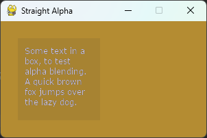
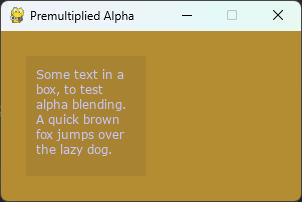

.. TUTORIAL:What is Premultiplied Alpha?

.. include:: ../../common.txt

****************************************************
  Pygame Tutorials - What is Premultiplied Alpha?
****************************************************

What is Premultiplied Alpha?
============================

.. rst-class:: docinfo

:Author: Dan Lawrence
:Contact: danintheshed@gmail.com

Introduction to Alpha Composition
---------------------------------

Alpha composition is the process by which we combine one or more semi-transparent images
into a final non-transparent image for display. In pygame-ce these images are called Surfaces
so I'll use that terminology going forwards.

The simplest example of an alpha composition is when we create a Surface, fill it with a color
that has an alpha channel, and then blit that surface direct to our display surface. For example:

.. code-block:: python
   :caption: Simple example of Straight Alpha composition
   :name: straight_alpha.py
   :linenos:

    import pygame
    from pygame import SRCALPHA, QUIT

    pygame.init()

    pygame.display.set_caption("Basic Composition")
    display_surf = pygame.display.set_mode((300, 170))

    # create a Surface with the SRCALPHA flag to add an extra channel of data
    # to each pixel that indicates how transparent it should be (from 0 - fully
    # transparent, to 255 - fully opaque.
    basic_surf = pygame.Surface((120, 120), flags=SRCALPHA)
    # the fourth number here sets the alpha to 25 (almost fully see through)
    basic_surf.fill((50, 50, 50, 25))

    running = True

    while running:
        for event in pygame.event.get():
            if event.type == QUIT:
                running = False

        display_surf.fill((180, 140, 50))

        display_surf.blit(basic_surf, (25, 25))

        pygame.display.flip()

This kind of alpha composition uses the 'Straight Alpha' formula: ::

    result = (source.RGB * source.A) + (destination.RGB * (1 - source.A))

In this formula our 'basic_surf' from the example code above would be the source, and our 'display_surf'
would be the destination.

The main advantage of this kind of alpha compositing is the independence of all the channels from one
another and the simplicity of its use. There is no setup required and most image editing programs will
export alpha in this way as a separate channel. This is why it is the default composition method in
pygame-ce.

How to use Premultiplied Alpha blending
---------------------------------------

Premultiplied alpha blending uses a slightly different formula to compose two surfaces ::

    result = source.RGB + (destination.RGB * (1 - source.A))

As you can see there is one less multiplication in there - this is because, as is implied by the name,
in a premultiplied alpha composition all the pixels colors have already been multiplied by their alpha
channel value.

We can rewrite the example above to use premultiplied alpha:

.. code-block:: python
   :caption: Simple example of Premultiplied Alpha composition
   :name: premultiplied_alpha.py
   :linenos:
   :emphasize-lines: 11,23

    import pygame
    from pygame import SRCALPHA, BLEND_PREMULTIPLIED, QUIT

    pygame.init()

    pygame.display.set_caption("Basic Composition")
    display_surf = pygame.display.set_mode((300, 170))

    basic_surf = pygame.Surface((120, 120), flags=SRCALPHA)
    basic_surf.fill((50, 50, 50, 25))
    basic_surf = basic_surf.premul_alpha()

    running = True

    while running:
        for event in pygame.event.get():
            if event.type == QUIT:
                running = False

        display_surf.fill((180, 140, 50))

        display_surf.blit(basic_surf, (25, 25),
                          special_flags=BLEND_PREMULTIPLIED)

        pygame.display.flip()

There are two main changes here. First setting the blend mode in the blit from the default blending
algorithm, which uses the straight alpha formula, to `BLEND_PREMULTIPLIED`. Second, we use the
`premul_alpha()` method on our alpha surface to return a Surface where the color channels have been
multiplied by the alpha.

Using `premul_alpha()` is just one way to get a premultiplied Surface, some image editing programs
will allow you to export images in a premultiplied alpha format, or you could manually convert an
image's alpha channel to a grayscale layer and multiply that with your image before your final export.

If you run the two programs above they should produce the exact same result.

Why would you use premultiplied alpha?
--------------------------------------

So far premultiplied alpha probably just seems like extra steps to get the same result. Why would you
want to use it over straight alpha?

There are two main reasons - and the first is performance. As you saw in the two formulas above, there
is one less mathematical operation to do at composition time with premultiplied alpha. Assuming you are
not adjusting your alpha in real-time - and in most game development usages you won't be, that is one
less operation to do per pixel which means, that on average your premultiplied alpha blits will be a
little bit faster than your straight alpha blits.

The second reason is a little more complicated to demonstrate so I've prepared a program to demonstrate
the issue. Essentially the straight alpha formula has issues when blending together two surfaces that
both contain alpha pixels, and the impact of this can vary from not noticeable at all to looking very
messy. Here is the example program for straight alpha:

.. code-block:: python
   :caption: Example of Straight Alpha composition between two surfaces with per-pixel alpha
   :name: straight_alpha_tool_tip.py
   :linenos:

    import pygame

    pygame.init()

    pygame.display.set_caption("Straight Alpha")
    display_surf = pygame.display.set_mode((300, 170))

    text_font = pygame.font.Font("fonts/verdana.ttf", size=12)

    tool_tip_text = text_font.render(
        "Some text in a box, to test alpha blending. "
        "A quick brown fox jumps over the lazy dog.",
        True,
        (200, 200, 250),
        wraplength=100,
    ).convert_alpha()

    tool_tip_surf = pygame.Surface((120, 120), flags=pygame.SRCALPHA)
    tool_tip_surf.fill((50, 50, 50, 25))

    tool_tip_surf.blit(tool_tip_text, (10, 10))

    running = True

    while running:
        for event in pygame.event.get():
            if event.type == pygame.QUIT:
                running = False

        display_surf.fill((180, 140, 50))

        display_surf.blit(tool_tip_surf, (25, 25))

        pygame.display.flip()

This example approximates the sort of code you might use to add a semi-transparent 'tool-tip'
pop up box in a pygame-ce application. You may need to change the path to the verdana font,
copy it into a 'fonts/' subdirectory or use an alternative font. The issue is visible on all
fonts but more obvious on some fonts than others depending on how much they rely on alpha pixels
for visibility. If you run this program you will get a result that looks like this:

Which, to my eyes, makes the text difficult to read and something of a strain on the eyes.

If we rewrite the example to use premultiplied alpha composition instead:

.. code-block:: python
   :caption: Example of Premultiplied Alpha composition between two surfaces with per-pixel alpha
   :name: premultiplied_alpha_tool_tip.py
   :linenos:
   :emphasize-lines: 5,17,21,24,36

    import pygame

    pygame.init()

    pygame.display.set_caption("Premultiplied Alpha")
    display_surf = pygame.display.set_mode((300, 170))

    text_font = pygame.font.Font("fonts/verdana.ttf", size=12)

    tool_tip_text = text_font.render(
        "Some text in a box, to test alpha blending. "
        "A quick brown fox jumps over the lazy dog.",
        True,
        (200, 200, 250),
        wraplength=100,
    ).convert_alpha()
    tool_tip_text = tool_tip_text.premul_alpha()

    tool_tip_surf = pygame.Surface((120, 120), flags=pygame.SRCALPHA)
    tool_tip_surf.fill((50, 50, 50, 25))
    tool_tip_surf = tool_tip_surf.premul_alpha()

    tool_tip_surf.blit(tool_tip_text, (10, 10),
                       special_flags=pygame.BLEND_PREMULTIPLIED)

    running = True

    while running:
        for event in pygame.event.get():
            if event.type == pygame.QUIT:
                running = False

        display_surf.fill((180, 140, 50))

        display_surf.blit(tool_tip_surf, (25, 25),
                          special_flags=pygame.BLEND_PREMULTIPLIED)

        pygame.display.flip()

You then get a result that looks like this:

Which is a lot easier to read.

Why does this happen? Essentially it is because in the Straight Alpha formula the combined pixels
colors are losing the influence of the alpha information for the destination surface's pixels.
If you scroll back up to the formula for Straight Alpha you will notice that destination alpha
doesn't appear anywhere in it. In the example, the destination alpha should reduce the influence
of the black tool tip box background color on the final pixels by a large amount, but in the straight
alpha version it doesn't so we get a lot of extra black blended into the alpha edges of our light
blue text.

In the premultiplied alpha formula all the color channels of both surfaces are already multiplied by
their alpha channel - so we don't lose any information during the composition formula and the end
result looks more like what we would expect.

---

And that is about all you need to know about alpha compositing and the differences between straight
alpha and premultiplied alpha. If you do want to learn more, then `wikipedia has a nice long article
for further reading. <https://en.wikipedia.org/wiki/Alpha_compositing>`_
