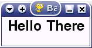

.. include:: ../../common.txt

**********************************
  Revisão: fundamentos do Pygame
**********************************

.. role:: primeiro termo (ênfase)

.. _makegames-2:

2. Revisão: fundamentos do Pygame
=================================

.. _makegames-2-1:

2.1. O jogo Pygame básico
-------------------------

Para fins de revisão e para garantir que você esteja familiarizado com a estrutura básica de um programa Pygame, examinarei brevemente
um programa Pygame básico, que não exibirá mais do que uma janela com algum texto, que deverá, no final, parecer algo como
isto (embora, claro, a decoração da janela provavelmente seja diferente no seu sistema):

O código completo deste exemplo é assim::

  #!/usr/bin/python

  import pygame
  from pygame.locals import *

  def main():
      # Initialise screen
      pygame.init()
      screen = pygame.display.set_mode((150, 50))
      pygame.display.set_caption('Basic Pygame program')

      # Fill background
      background = pygame.Surface(screen.get_size())
      background = background.convert()
      background.fill((250, 250, 250))

      # Display some text
      font = pygame.font.Font(None, 36)
      text = font.render("Hello There", 1, (10, 10, 10))
      textpos = text.get_rect()
      textpos.centerx = background.get_rect().centerx
      background.blit(text, textpos)

      # Blit everything to the screen
      screen.blit(background, (0, 0))
      pygame.display.flip()

      # Event loop
      while True:
          for event in pygame.event.get():
              if event.type == QUIT:
                  return

          screen.blit(background, (0, 0))
          pygame.display.flip()

  if __name__ == '__main__': main()

.. _makegames-2-2:

2.2. Objetos Pygame básicos
---------------------------

Como você pode ver, o código consiste em três objetos principais: a tela, o plano de fundo e o texto. Cada um desses objetos é criado
primeiro chamando uma instância de um objeto Pygame embutido e, em seguida, modificando-o para atender às nossas necessidades. A tela é um pouco especial
caso, porque ainda modificamos a exibição por meio de chamadas Pygame, em vez de chamar métodos pertencentes ao objeto de tela. Mas pelo
todos os outros objetos Pygame, primeiro criamos o objeto como uma cópia de um objeto Pygame, dando-lhe alguns atributos, e construímos nosso jogo
objetos deles.

Com o plano de fundo, primeiro criamos um objeto Pygame Surface e o tornamos do tamanho da tela. Em seguida, realizamos o convert()
operação para converter a superfície em um formato de pixel único. Isto é mais obviamente necessário quando temos várias imagens e superfícies,
todos os diferentes formatos de pixel, o que torna sua renderização bastante lenta. Ao converter todas as superfícies, podemos acelerar drasticamente
tempos de renderização. Finalmente, preenchemos a superfície de fundo com branco (255, 255, 255). Esses valores são :firstterm:`RGB` (Vermelho Verde
Azul) e pode ser elaborado a partir de qualquer bom programa de pintura.

Com o texto, exigimos mais de um objeto. Primeiro, criamos um objeto font, que define qual fonte usar e o tamanho da fonte.
Fonte. Então criamos um objeto de texto, usando o método ``render`` que pertence ao nosso objeto fonte, fornecendo três argumentos:
o texto a ser renderizado, se deve ou não ter suavização de serrilhado (1=sim, 0=não) e a cor do texto (novamente no formato RGB). Próximo
criamos um terceiro objeto de texto, que obtém o retângulo do texto. A maneira mais fácil de entender isso é imaginar desenhar um
retângulo que circundará todo o texto; você pode então usar este retângulo para obter/definir a posição do texto na tela. Então
neste exemplo obtemos o retângulo, definimos seu atributo ``centerx`` como o atributo ``centerx`` do
plano de fundo (para que o centro do texto seja igual ao centro do plano de fundo, ou seja, o texto será centralizado na tela no x
eixo). Também poderíamos definir a coordenada y, mas não é diferente, então deixei o texto no topo da tela. Como a tela é
pequeno de qualquer maneira, não parecia necessário.

.. _makegames-2-3:

2.3. Blitting
-------------

Agora que criamos nossos objetos de jogo, precisamos renderizá-los. Se não o fizéssemos e executássemos o programa, veríamos apenas um
janela em branco e os objetos permaneceriam invisíveis. O termo usado para renderizar objetos é :firstterm:`blitting`, que é onde
você copia os pixels pertencentes ao referido objeto para o objeto de destino. Então, para renderizar o objeto de fundo, você o coloca no
tela. Neste exemplo, para simplificar as coisas, colocamos o texto no fundo (para que o fundo agora tenha uma cópia do
texto nele) e, em seguida, coloque o fundo na tela.

Blitting é uma das operações mais lentas em qualquer jogo, então você precisa ter cuidado para não espalhar muito na tela em cada quadro.
Se você tiver uma imagem de fundo e uma bola voando ao redor da tela, você poderá apagar o fundo e depois a bola em cada
frame, que encobriria a posição anterior da bola e renderizaria a nova bola, mas isso seria bem lento. Uma solução melhor é
para espalhar o fundo na área que a bola ocupava anteriormente, que pode ser encontrada pelo retângulo anterior da bola, e então
quebrando a bola, de modo que você esteja batendo apenas em duas pequenas áreas.

.. _makegames-2-4:

2.4. O ciclo de eventos
-----------------------

Depois de configurar o jogo, você precisa colocá-lo em um loop para que ele funcione continuamente até que o usuário sinalize que deseja
sair. Então você inicia um loop ``while`` aberto, e então para cada iteração do loop, que será cada frame do jogo,
atualize o jogo. A primeira coisa é verificar se há algum evento Pygame, que será o usuário apertando o teclado, clicando com o mouse
botão, movendo um joystick, redimensionando a janela ou tentando fechá-la. Nesse caso, queremos simplesmente ficar atentos às tentativas do usuário
para sair do jogo fechando a janela, nesse caso o jogo deverá ``return``, o que encerrará o loop ``while``.
Em seguida, precisamos simplesmente iluminar novamente o fundo e virar (atualizar) a tela para que tudo seja desenhado. OK, já que nada se move ou acontece
neste exemplo, estritamente falando, não precisamos refazer o background em cada iteração, mas eu coloquei isso porque quando as coisas estão
movendo-se na tela, você precisará fazer todos os seus blitting aqui.

.. _makegames-2-5:

2.5. Ta-da!
-----------

E é isso :) seu jogo Pygame mais básico! Todos os jogos terão um formato semelhante a este, mas com muito mais código para o jogo real
funções em si, que têm mais a ver com programação e menos guiadas em estrutura pelo funcionamento do Pygame. Isso é o que
este tutorial é realmente sobre isso e agora prosseguiremos.

