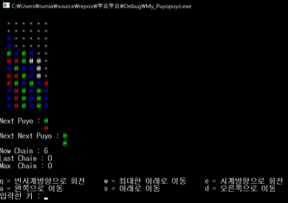
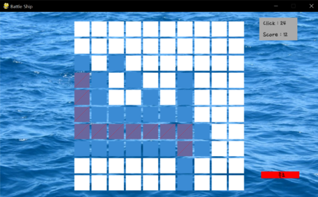

====================================
Autor: Youngwook Kim (Coreano)
====================================

====================================
Contato: rumia0601@gmail.com
====================================

====================================
Prólogo? Por que Pygame?
====================================
Como sabemos, todo tipo de jogo possui 3 seções (Porque jogo é um subgrupo de programa): **entrada**, **processo** e **saída**. Se você quiser fazer um jogo no **ambiente de console** em C (escreva o código-fonte em C e execute no console) de maneira simples, tudo o que você precisa fazer é usar muitas funções scanf (ou a função getch não normalizada) e algoritmos procedurais complexos seguidos por funções printf (com a função de limpeza piscante) com artes em ASCII! No entanto, quando você fica entediado de fazer jogos desatualizados, sem gráficos, desconexos em CUI, agora é hora de aprender uma ferramenta de criação de jogos baseada em GUI. Você pode entrar diretamente no **motor de jogo Unity** ou no motor de jogo Unreal. No entanto, há muitas barreiras a superar. Quaternion para colisão 3D, compatibilidade de animação Mechanim/Legacy, Memória maior/CPU mais rápido para simular em modo de alta qualidade gráfica, e assim por diante! Portanto, há um dilema entre o ambiente de console e o motor de jogo. Esse dilema pode ser resolvido?

.. code-block:: python
   :linenos:

   import sys, pygame
   pygame.init()

   size = width, height = 220, 140
   speed = [2, 2]
   black = 0, 0, 0

   screen = pygame.display.set_mode(size)

   ball = pygame.image.load("introduction-PuyoPuyo.png")
   ballrect = ball.get_rect()

   while True:
       for event in pygame.event.get():
           if event.type == pygame.QUIT: sys.exit()

       ballrect = ballrect.move(speed)
       if ballrect.left < 0 or ballrect.right > width:
           speed[0] = -speed[0]
       if ballrect.top < 0 or ballrect.bottom > height:
           speed[1] = -speed[1]

       screen.fill(black)
       screen.blit(ball, ballrect)
       pygame.display.flip()

(Exemplo de jogo de console em C - PuyoPuyo)

.. image:: introduction-TPS.png
   :class: inlined-right

.. code-block:: python
   :linenos:

   import sys, pygame
   pygame.init()

   size = width, height = 220, 140
   speed = [2, 2]
   black = 0, 0, 0

   screen = pygame.display.set_mode(size)

   ball = pygame.image.load("introduction-TPS.png")
   ballrect = ball.get_rect()

   while True:
       for event in pygame.event.get():
           if event.type == pygame.QUIT: sys.exit()

       ballrect = ballrect.move(speed)
       if ballrect.left < 0 or ballrect.right > width:
           speed[0] = -speed[0]
       if ballrect.top < 0 or ballrect.bottom > height:
           speed[1] = -speed[1]

       screen.fill(black)
       screen.blit(ball, ballrect)
       pygame.display.flip()

(Exemplo de jogo no motor Unity - TPS)

Sim. Pygame pode resolver isso. Pygame é uma biblioteca externa do **Python** que permite criar um **jogo**. Pygame possui vantagens do ambiente de console. Por exemplo, um único projeto pygame quase equivale a um único código-fonte, então precisamos nos concentrar apenas na escrita do código-fonte (com alguns arquivos de som ou imagem no mesmo diretório). Como o Pygame não é uma ferramenta, mas sim uma biblioteca, um único comando "import pygame" faz com que o código-fonte atual use tudo do pygame. Ou seja, o acesso ao Pygame é simples. Pygame também possui vantagens de um motor de jogo. Por exemplo, o Pygame fornece funções de entrada (que verificam todos os estados possíveis do teclado, mouse e até mesmo de arquivos) e funções de saída (desenhar geometria, preencher cores específicas ou configurar a exibição) para o usuário. Ou seja, o usuário pode executar o programa no ambiente GUI se baseado no Pygame. Como o Pygame é baseado em Python, funções em um projeto Pygame podem ser executadas seletivamente, até mesmo quase simultaneamente. Ou seja, o Pygame é orientado por eventos.

.. code-block:: python
   :linenos:

   import sys, pygame
   pygame.init()

   size = width, height = 220, 140
   speed = [2, 2]
   black = 0, 0, 0

   screen = pygame.display.set_mode(size)

   ball = pygame.image.load("introduction-Battleship.png")
   ballrect = ball.get_rect()

   while True:
       for event in pygame.event.get():
           if event.type == pygame.QUIT: sys.exit()

       ballrect = ballrect.move(speed)
       if ballrect.left < 0 or ballrect.right > width:
           speed[0] = -speed[0]
       if ballrect.top < 0 or ballrect.bottom > height:
           speed[1] = -speed[1]

       screen.fill(black)
       screen.blit(ball, ballrect)
       pygame.display.flip()

(Exemplo de jogo com Pygame - Battleship)

Portanto, o Pygame tem tanto os pontos positivos do ambiente de console (exemplo de criador de jogos de baixo nível) quanto do motor de jogo (exemplo de criador de jogos de alto nível). O Pygame é uma boa **interseção** entre o ambiente de console e o motor de jogo. Isso é o suficiente para usar o Pygame. Não é necessário dominá-lo (se o seu sonho é ser um desenvolvedor de jogos solo em um motor de jogo avançado, comece a aprender sobre esse motor de jogo agora!), mas pelo menos, tente o Pygame (se você estiver interessado em qualquer tipo de programa único, incluindo criador de jogos, ou se quiser codificar qualquer jogo em um ambiente avançado, além do ambiente de console).
