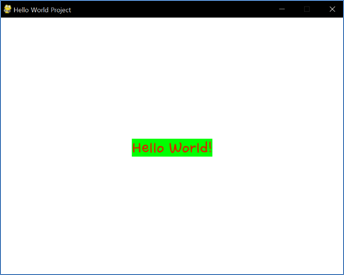

====================================
Autor: Youngwook Kim (Coreano)
====================================

====================================
Contato: rumia0601@gmail.com
====================================

====================================
Modelo Básico e Saída
====================================

====================================
Entrando em Eventos e GUI
====================================
Como mencionado, o Pygame é baseado em ambiente GUI. Além disso, o Pygame é bom para criar jogos 2D devido ao seu formato de entrada/saída. Portanto, você deve dizer adeus para as funções padrão de impressão ou entrada do Python (porque elas funcionam apenas em ambiente CUI). Então, quais funções no Pygame substituem essas funções? Primeiro, temos que voltar ao amigável projeto "Hello World!", que é sobre aprender o modelo básico e a saída. **(Requer qualquer arquivo de fonte (.ttf) no mesmo diretório do projeto)**

.. image:: Basic-ouput-sourcecode.png
   :class: inlined-right

.. code-block:: python
   :linenos:

   import sys, pygame
   pygame.init()

   size = width, height = 220, 140
   speed = [2, 2]
   black = 0, 0, 0

   screen = pygame.display.set_mode(size)

   ball = pygame.image.load("Basic-ouput-sourcecode.png")
   ballrect = ball.get_rect()

   while True:
       for event in pygame.event.get():
           if event.type == pygame.QUIT: sys.exit()

       ballrect = ballrect.move(speed)
       if ballrect.left < 0 or ballrect.right > width:
           speed[0] = -speed[0]
       if ballrect.top < 0 or ballrect.bottom > height:
           speed[1] = -speed[1]

       screen.fill(black)
       screen.blit(ball, ballrect)
       pygame.display.flip()

.. code-block:: python
   :linenos:

   import sys, pygame
   pygame.init()

   size = width, height = 220, 140
   speed = [2, 2]
   black = 0, 0, 0

   screen = pygame.display.set_mode(size)

   ball = pygame.image.load("Bagic-ouput-result-screen.png")
   ballrect = ball.get_rect()

   while True:
       for event in pygame.event.get():
           if event.type == pygame.QUIT: sys.exit()

       ballrect = ballrect.move(speed)
       if ballrect.left < 0 or ballrect.right > width:
           speed[0] = -speed[0]
       if ballrect.top < 0 or ballrect.bottom > height:
           speed[1] = -speed[1]

       screen.fill(black)
       screen.blit(ball, ballrect)
       pygame.display.flip()

(Código Fonte para o Projeto Hello World e sua tela de resultado)

Uau, é complicado em comparação com o print("Hello World") do Python (apenas um comando de linha única). Isso ocorre porque o texto em ambiente GUI tem 5 componentes: conteúdo do texto, fonte, tamanho, cor e localização. Se você quiser imprimir qualquer texto na tela, é necessário definir os outros 4 componentes, não apenas a string (a menos que esteja em ambiente GUI). Somente a função ``pygame.display.set_caption("Hello World Project")`` em #7 faz a mesma função que o print("Hello World Project") do Python. A única diferença é que a string de saída está sempre na legenda da janela (título do programa atual).

Primeiro, observe o modelo do código-fonte antes de entender como imprimir algo; o código-fonte pode ser dividido em 4 seções: Cabeçalho (#1-#2), Declaração Inicial (#3-#12), Declaração Sempre (#13-#20) e Declaração de Evento (#16-#19).

No **Cabeçalho**, a importação de módulos será executada. ``import pygame, sys`` é sempre necessário. Sem dúvida, porque este é um projeto Pygame e o jogo deve ser encerrado quando o jogador deseja sair (``sys.exit()`` em #19). ``from pygame.locals import*`` também é necessário para usar constantes úteis, assim como ``QUIT`` em #17.
Na **Declaração Inicial** (comandos antes do loop infinito), alguns valores globais serão inicializados e algumas funções serão chamadas uma vez. Valores globais, como cores, precisam ser inicializados aqui para aumentar a legibilidade. Lembre-se, isso é uma GUI que é colorida. A cor tem três componentes: vermelho, verde e azul. Portanto, o valor da cor deve ser inicializado, assim como ``red = (255, 0, 0)``. A função chamada ``pygame.init()`` deve ser chamada antes de outras funções do pygame. Em seguida, outras funções do pygame podem ser executadas. (Outras funções do pygame serão explicadas posteriormente.)

Na **Declaração Sempre** (comandos dentro do loop infinito), alguns valores globais serão atualizados rotineiramente e algumas funções serão chamadas rotineiramente, a menos que estejam envolvidas em uma instrução condicional. A função chamada ``pygame.display.update()`` deve ser chamada após cada processo ser concluído. Porque esta função está imprimindo os resultados dos processos na tela (= monitor). Se esta função não for executada na última parte da Declaração Sempre, há uma probabilidade de que a tela atual e os dados internos não correspondam. (Outras funções do pygame serão explicadas posteriormente.)

Na **Declaração de Evento** (comandos dentro do loop que verifica todos os eventos possíveis), haverá instruções condicionais adequadas quando um determinado evento for acionado. A função ``pygame.event.get()`` retorna uma lista de eventos ocorridos pelos processos na Declaração Sempre. E esta lista é automaticamente organizada por tempo (mais antigo para mais recente). Portanto, usando a instrução for-in, cada evento acionado pela Declaração Sempre pode ser resolvido proceduralmente. (Lembre-se de que esta é a característica do evento orientado.) Por exemplo, os comandos em #17-#19 lidarão com o evento QUIT. Nesse caso, o pygame será encerrado e o sistema será encerrado porque o sistema deve ser encerrado após o pygame ser encerrado! (Outros eventos serão explicados posteriormente.)

Dado que este modelo é fixo, podemos adicionar funções especiais no lugar certo para imprimir "Hello World!". Primeiro, precisamos definir **fonte** e **tamanho**. A função ``pygame.font.Font("HoonWhiteCatR.ttf", 32)`` em #9 definirá não apenas a fonte pelo arquivo ttf, mas também o tamanho (32). O valor de retorno desta função precisa ser armazenado em um objeto (= myTextFont). Em seguida, a função de membro de myTextFont chamada ``render("Hello World!", True, red, green)`` em #10 retornará um valor (= myText). A função render pode definir **conteúdo de texto** e **cor** (vermelho é a cor do texto, verde é a cor da área fora do texto). Em seguida, a função de membro de myText chamada ``get_rect()`` em #11 retornará um valor (= myTextArea). myTextArea significa a área alocada para imprimir texto. Quando get_rect() é chamado, uma área retangular é retornada correspondente ao comprimento do texto e ao tamanho da fonte. Agora, tudo o que temos que fazer é posicionar esta área em algum lugar. Se mudarmos o valor do membro de myTextArea chamado ``center`` em #12 para o centro da tela, então a **localização** do centro do texto será o centro da tela.

Mas como determinar onde está o centro da tela? Primeiro, temos que decidir a extensão da tela, usando ``pygame.display.set_mode((640,480))`` em #8, um canvas (onde todos os valores que têm tamanho, cor, posição serão desenhados quando display.update for chamado) será gerado e seu tamanho se tornará 640 x 480. Então, seu centro é exatamente (320,240). Se o tamanho total for fornecido, podemos decidir qualquer posição mesmo considerando alguma margem com pouco cálculo (Lembre-se que em GUI 2D, tudo tem x e y que precisam ser impressos) (Assim como gráficos de tartarugas, se ele vai **para a direita, x aumenta**, se ele vai **para baixo, y aumenta**. Não se confunda!). E sabemos que todas as funções que mencionei serão colocadas na Declaração Inicial, porque essas informações são fixas enquanto o programa continua.
Embora tudo seja fixo, temos que projetar as funções fill e blit para serem colocadas na Declaração Sempre, por causa da característica dessas funções. A função ``fill(white)`` em #14 significa preencher o canvas com uma única cor (branco). A função ``blit(myText, myTextArea)`` em #15 significa desenhar um objeto específico (= myText) em uma localização específica (= myTextArea) do canvas. Observe que o desenho (blit) deve ser feito após o preenchimento (fill). Quando tudo é desenhado no canvas, o resultado do canvas será exibido na janela quando display.update for executado.

Essa foi a explicação do código-fonte inteiro, que tem 20 linhas. Parece que leva muito tempo para entender o código-fonte com apenas 20 linhas. No entanto, adicionar ou alterar a partir deste código-fonte não é tão difícil porque entendemos o modelo deste código-fonte e o passo da impressão. E quanto a adicionar lógica de processamento a este código-fonte? Isso será o próximo projeto.

<Código de Referência> ::

    import pygame, sys #1
    from pygame.locals import* #2

    white = (255,255,255) #3
    red = (255,0,0) #4
    green = (0,255,0) #5
    pygame.init() #6
    pygame.display.set_caption("Hello World Project") #7
    myScreen = pygame.display.set_mode((640, 480)) #8
    myTextFont = pygame.font.Font("HoonWhitecatR.ttf", 32) #9
    myText = myTextFont.render("Hello World!", True, red, green) #10 
    myTextArea = myText.get_rect() #11
    myTextArea.center = (320, 240) #12

    while True: #13
        myScreen.fill(white) #14
        myScreen.blit(myText, myTextArea) #15

        for event in pygame.event.get(): #16
            if event.type == QUIT: #17
                pygame.quit() #18
                sys.exit() #19

        pygame.display.update() #20
