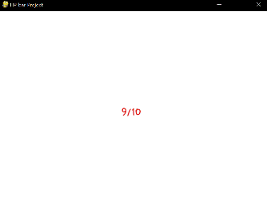
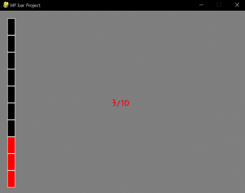

====================================
Autor: Youngwook Kim (Coreano)
====================================

====================================
Contato: rumia0601@gmail.com
====================================

=========================================
com PROCESSO Avançado - Funcionalização
=========================================

Primeiro, vamos imprimir geometria visualizada, não texto. Que tal uma barra de HP? Se o HP máximo do jogo é fixo e o HP atual do jogo pode variar de 0 a HP máximo, qual será a maneira mais simples de imprimir ambos os dados?

.. code-block:: python
   :linenos:

   import sys, pygame
   pygame.init()

   size = width, height = 320, 240
   speed = [2, 2]
   black = 0, 0, 0

   screen = pygame.display.set_mode(size)

   ball = pygame.image.load("AdvancedOutputProcess1.gif")
   ballrect = ball.get_rect()

   while True:
       for event in pygame.event.get():
           if event.type == pygame.QUIT: sys.exit()

       ballrect = ballrect.move(speed)
       if ballrect.left < 0 or ballrect.right > width:
           speed[0] = -speed[0]
       if ballrect.top < 0 or ballrect.bottom > height:
           speed[1] = -speed[1]

       screen.fill(black)
       screen.blit(ball, ballrect)
       pygame.display.flip()

.. image:: AdvancedOutputProcess2.gif
   :class: inlined-right

.. code-block:: python
   :linenos:

   import sys, pygame
   pygame.init()

   size = width, height = 320, 240
   speed = [2, 2]
   black = 0, 0, 0

   screen = pygame.display.set_mode(size)

   ball = pygame.image.load("AdvancedOutputProcess2.gif")
   ballrect = ball.get_rect()

   while True:
       for event in pygame.event.get():
           if event.type == pygame.QUIT: sys.exit()

       ballrect = ballrect.move(speed)
       if ballrect.left < 0 or ballrect.right > width:
           speed[0] = -speed[0]
       if ballrect.top < 0 or ballrect.bottom > height:
           speed[1] = -speed[1]

       screen.fill(black)
       screen.blit(ball, ballrect)
       pygame.display.flip()

.. code-block:: python
   :linenos:

   import sys, pygame
   pygame.init()

   size = width, height = 320, 240
   speed = [2, 2]
   black = 0, 0, 0

   screen = pygame.display.set_mode(size)

   ball = pygame.image.load("AdvancedOutputProcess3.gif")
   ballrect = ball.get_rect()

   while True:
       for event in pygame.event.get():
           if event.type == pygame.QUIT: sys.exit()

       ballrect = ballrect.move(speed)
       if ballrect.left < 0 or ballrect.right > width:
           speed[0] = -speed[0]
       if ballrect.top < 0 or ballrect.bottom > height:
           speed[1] = -speed[1]

       screen.fill(black)
       screen.blit(ball, ballrect)
       pygame.display.flip()

Sim, apenas redesenhando texto quando uma determinada variável é alterada. Como mudar a variável? Essa lógica está dentro da instrução de evento. (Pressionando para cima ou para baixo para ajustar o HP.) Mesmo método que antes. Mas ainda são textos, o que significa que não são visualizados o suficiente. Como visualizar esses dois dados mais detalhadamente (HP máximo, HP atual)? Podemos usar a ideia de uma revista (carregador de uma arma). O HP é um valor inteiro, que é discreto. Então, pode ser impresso da seguinte forma:

.. image:: AdvancedOutputProcess4.gif
   :class: inlined-right

.. code-block:: python
   :linenos:

   import sys, pygame
   pygame.init()

   size = width, height = 320, 240
   speed = [2, 2]
   black = 0, 0, 0

   screen = pygame.display.set_mode(size)

   ball = pygame.image.load("AdvancedOutputProcess4.gif")
   ballrect = ball.get_rect()

   while True:
       for event in pygame.event.get():
           if event.type == pygame.QUIT: sys.exit()

       ballrect = ballrect.move(speed)
       if ballrect.left < 0 or ballrect.right > width:
           speed[0] = -speed[0]
       if ballrect.top < 0 or ballrect.bottom > height:
           speed[1] = -speed[1]

       screen.fill(black)
       screen.blit(ball, ballrect)
       pygame.display.flip()

.. code-block:: python
   :linenos:

   import sys, pygame
   pygame.init()

   size = width, height = 320, 240
   speed = [2, 2]
   black = 0, 0, 0

   screen = pygame.display.set_mode(size)

   ball = pygame.image.load("AdvancedOutputProcess5.gif")
   ballrect = ball.get_rect()

   while True:
       for event in pygame.event.get():
           if event.type == pygame.QUIT: sys.exit()

       ballrect = ballrect.move(speed)
       if ballrect.left < 0 or ballrect.right > width:
           speed[0] = -speed[0]
       if ballrect.top < 0 or ballrect.bottom > height:
           speed[1] = -speed[1]

       screen.fill(black)
       screen.blit(ball, ballrect)
       pygame.display.flip()

.. image:: AdvancedOutputProcess6.gif
   :class: inlined-right

.. code-block:: python
   :linenos:

   import sys, pygame
   pygame.init()

   size = width, height = 320, 240
   speed = [2, 2]
   black = 0, 0, 0

   screen = pygame.display.set_mode(size)

   ball = pygame.image.load("AdvancedOutputProcess6.gif")
   ballrect = ball.get_rect()

   while True:
       for event in pygame.event.get():
           if event.type == pygame.QUIT: sys.exit()

       ballrect = ballrect.move(speed)
       if ballrect.left < 0 or ballrect.right > width:
           speed[0] = -speed[0]
       if ballrect.top < 0 or ballrect.bottom > height:
           speed[1] = -speed[1]

       screen.fill(black)
       screen.blit(ball, ballrect)
       pygame.display.flip()

Muito melhor, não é? A lógica de desenho está dentro do #6. A lógica é simples, primeiro, desenhe um **retângulo grande** cuja cor é preta. Em seguida, verifique se deve desenhar um **retângulo menor** cuja cor é vermelha, dependendo do HP atual. Finalmente, desenhe **margem** do retângulo pequeno atual. A margem da cor é branca. Podemos ver que existem 4 parâmetros para dados de localização em ``pygame.draw.rect`` (Quero dizer, terceiro dado. O primeiro dado é dado de tela, o segundo dado é dado de cor e o quarto dado é largura.) A maneira mais fácil de entender os 4 parâmetros é alterá-los. Altere um valor para 10 ou 30 enquanto os outros são 20! Então pode ser compreendido. Sem necessidade de explicação.

Além disso, agora é hora de funcionalizar especificamente. Eu coloco as instruções Always e a instrução Evento na função principal. (#7 é necessário para encontrar a função principal e executá-la.) E fiz uma nova função para desenharHP. A ideia de funcionalização para o jogo não está longe da de um programa GUI normal. Por exemplo, é melhor fazer **uma única função de impressão para cada valor individual** que precisa ser exibido. Claro, a configuração de localização para cada valor deve ser feita enquanto você está projetando a tela.

<Código de Referência> ::

    import pygame, sys
    from pygame.locals import*
    
    maxHP = 10 
    white = (255,255,255)
    gray = (127,127,127)
    black = (0,0,0)
    red = (255,0,0)
    green = (0,255,0)
    blue = (0,0,255)
    pygame.init()
    pygame.display.set_caption("Projeto Barra de HP")
    width = 640 #1
    height = 480 #2
    myScreen = pygame.display.set_mode((width, height))
    myTextFont = pygame.font.Font("HoonWhitecatR.ttf", 32)
    myText = myTextFont.render((str(maxHP) + "/" + str(maxHP)), True, red, gray)
    myTextArea = myText.get_rect()
    myTextArea.center = (width/2, height/2) #3
    fpsClock = pygame.time.Clock()
    
    def main(): #4
        HP = 5
        
        while True:
            myText = myTextFont.render((str(HP) + "/" + str(maxHP)), True, red, gray)
        
            myScreen.fill(gray)
    
            myScreen.blit(myText, myTextArea)
            drawHP(HP) #5
    
            for event in pygame.event.get():
                if event.type == QUIT:
                    pygame.quit()
                    sys.exit()
                elif event.type == KEYDOWN:
                    if event.key == K_UP:
                        if HP != 10:
                            HP = HP + 1
                    elif event.key == K_DOWN:
                        if HP != 0:
                            HP = HP - 1
        
            pygame.display.update()
            fpsClock.tick(60)
    
    def drawHP(HP): #6
        r = int((height - 40) / maxHP)
    
        pygame.draw.rect(myScreen, black, (20, 20, 20, 20 + ((maxHP - 0.5) * r)))
    
        for i in range(maxHP):
            if HP >= (maxHP - i):
                pygame.draw.rect(myScreen, red, (20, 20 + (i * r), 20, r))
            pygame.draw.rect(myScreen, white, (20, 20 + (i * r), 20, r), 1)
    
        return
    
    if __name__ == '__main__': #7
        main()
