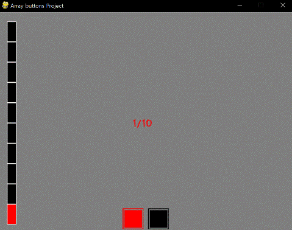

====================================
Autor: Youngwook Kim (Coreano)
====================================

====================================
Contato: rumia0601@gmail.com
====================================

====================================
com SAÍDA Avançada - Botões
====================================

Mesmo que o evento KEYDOWN seja usado, parece que isso não é inteiramente um jogo GUI porque a GUI deste jogo é usada apenas para saída (=impressão), não para entrada. Entrada para GUI significa cuidar do evento do mouse para uma localização específica. Que tal fazer dois botões para aumentar ou diminuir o HP?

.. image:: ../../../assets/AdvancedInputOutput1.gif
   :class: inlined-right

.. code-block:: python
   :linenos:

   import sys, pygame
   pygame.init()

   size = width, height = 320, 240
   speed = [2, 2]
   black = 0, 0, 0

   screen = pygame.display.set_mode(size)

   ball = pygame.image.load("AdvancedInputOutput1.gif")
   ballrect = ball.get_rect()

   while True:
       for event in pygame.event.get():
           if event.type == pygame.QUIT: sys.exit()

       ballrect = ballrect.move(speed)
       if ballrect.left < 0 or ballrect.right > width:
           speed[0] = -speed[0]
       if ballrect.top < 0 or ballrect.bottom > height:
           speed[1] = -speed[1]

       screen.fill(black)
       screen.blit(ball, ballrect)
       pygame.display.flip()

.. image:: ../../../assets/AdvancedInputOutput2.gif
   :class: inlined-right

.. code-block:: python
   :linenos:

   import sys, pygame
   pygame.init()

   size = width, height = 320, 240
   speed = [2, 2]
   black = 0, 0, 0

   screen = pygame.display.set_mode(size)

   ball = pygame.image.load("AdvancedInputOutput2.gif")
   ballrect = ball.get_rect()

   while True:
       for event in pygame.event.get():
           if event.type == pygame.QUIT: sys.exit()

       ballrect = ballrect.move(speed)
       if ballrect.left < 0 or ballrect.right > width:
           speed[0] = -speed[0]
       if ballrect.top < 0 or ballrect.bottom > height:
           speed[1] = -speed[1]

       screen.fill(black)
       screen.blit(ball, ballrect)
       pygame.display.flip()

Ok, fazer dois botões é simples. Olhe para o botão, eles têm uma forma visual única. Como pode ser? Simples como a ideia anterior: Primeiro, desenhe um **quadrado grande**. Segundo, desenhe um **quadrado menor** que tem largura pequena (esse quadrado não tem cor interna, para que a cor do quadrado grande possa ser exibida), então o quadrado interno e o quadrado externo parecem separados. Mas esses botões ainda são apenas para saída. Precisamos criar uma área de clique para isso.

.. image:: ../../../assets/AdvancedInputOutput3.gif
   :class: inlined-right

.. code-block:: python
   :linenos:

   import sys, pygame
   pygame.init()

   size = width, height = 320, 240
   speed = [2, 2]
   black = 0, 0, 0

   screen = pygame.display.set_mode(size)

   ball = pygame.image.load("AdvancedInputOutput3.gif")
   ballrect = ball.get_rect()

   while True:
       for event in pygame.event.get():
           if event.type == pygame.QUIT: sys.exit()

       ballrect = ballrect.move(speed)
       if ballrect.left < 0 or ballrect.right > width:
           speed[0] = -speed[0]
       if ballrect.top < 0 or ballrect.bottom > height:
           speed[1] = -speed[1]

       screen.fill(black)
       screen.blit(ball, ballrect)
       pygame.display.flip()

.. image:: ../../../assets/AdvancedInputOutput4.gif
   :class: inlined-right

.. code-block:: python
   :linenos:

   import sys, pygame
   pygame.init()

   size = width, height = 320, 240
   speed = [2, 2]
   black = 0, 0, 0

   screen = pygame.display.set_mode(size)

   ball = pygame.image.load("AdvancedInputOutput4.gif")
   ballrect = ball.get_rect()

   while True:
       for event in pygame.event.get():
           if event.type == pygame.QUIT: sys.exit()

       ballrect = ballrect.move(speed)
       if ballrect.left < 0 or ballrect.right > width:
           speed[0] = -speed[0]
       if ballrect.top < 0 or ballrect.bottom > height:
           speed[1] = -speed[1]

       screen.fill(black)
       screen.blit(ball, ballrect)
       pygame.display.flip()

.. code-block:: python
   :linenos:

   import sys, pygame
   pygame.init()

   size = width, height = 320, 240
   speed = [2, 2]
   black = 0, 0, 0

   screen = pygame.display.set_mode(size)

   ball = pygame.image.load("AdvancedInputOutput5.gif")
   ballrect = ball.get_rect()

   while True:
       for event in pygame.event.get():
           if event.type == pygame.QUIT: sys.exit()

       ballrect = ballrect.move(speed)
       if ballrect.left < 0 or ballrect.right > width:
           speed[0] = -speed[0]
       if ballrect.top < 0 or ballrect.bottom > height:
           speed[1] = -speed[1]

       screen.fill(black)
       screen.blit(ball, ballrect)
       pygame.display.flip()

Agora um novo evento ``MOUSEBUTTONUP`` é adicionado na instrução de evento. Observe que o "up" do mouse é o mesmo que o "down" da tecla. Se o MOUSEBUTTONUP for ativado, ``event.pos`` será registrado como x e y. O que significa, ponto clicado. Portanto, é necessário determinar se o ponto clicado está dentro de uma determinada área de Rect ou não, verificando ``collidepoint``. Se estiver dentro, significa "**o usuário clicou em algum ponto que faz parte de uma determinada área**" então, um processo adequado (atualização de valor) é necessário.
Observe que existem duas áreas para entrada:
**(270, 425, 45, 45)** e **(325, 425, 45, 45)** na instrução de evento.
Observe também que existem duas áreas para saída.
**(margem, altura - r -10 , r, r)** e **(margem + r + r_margin, altura - r - 10, r, r)** em drawButtons.
No caso do botão, a área de entrada e saída para o botão deve ser **idêntica**. (Caso contrário, este botão será enganoso!) Será a melhor ideia definir esses dados como o mesmo valor sem calcular a localização exata da função (para saída) em uma constante (para entrada). Não há uma função específica para amarrar esta área, então você precisa se preocupar com isso.

<Código de Referência> ::

    import pygame, sys
    from pygame.locals import*
    
    maxHP = 10 
    white = (255,255,255)
    gray = (127,127,127)
    black = (0,0,0)
    red = (255,0,0)
    green = (0,255,0)
    blue = (0,0,255)
    pygame.init()
    pygame.display.set_caption("Projeto Botões de Matriz")
    width = 640 
    height = 480
    myScreen = pygame.display.set_mode((width, height))
    myTextFont = pygame.font.Font("HoonWhitecatR.ttf", 32)
    myText = myTextFont.render((str(maxHP) + "/" + str(maxHP)), True, red, gray)
    myTextArea = myText.get_rect()
    myTextArea.center = (width/2, height/2)
    fpsClock = pygame.time.Clock()
    
    def main():
        HP = 5
        
        while True:
            myText = myTextFont.render((str(HP) + "/" + str(maxHP)), True, red, gray)
        
            myScreen.fill(gray)
    
            myScreen.blit(myText, myTextArea)
            drawHP(HP)
            drawButtons()
    
            for event in pygame.event.get():
                if event.type == QUIT:
                    pygame.quit()
                    sys.exit()
                elif event.type == KEYDOWN:
                    if event.key == K_UP:
                        if HP != 10:
                            HP = HP + 1
                    elif event.key == K_DOWN:
                        if HP != 0:
                            HP = HP - 1
                elif event.type == MOUSEBUTTONUP: #1
                    x, y = event.pos
                    if pygame.Rect(270, 425, 45, 45).collidepoint(x, y):
                        if HP != 10:
                            HP = HP + 1
                    elif pygame.Rect(325, 425, 45, 45).collidepoint(x, y):
                        if HP != 0:
                            HP = HP - 1      
        
            pygame.display.update()
            fpsClock.tick(60)
    
    def drawHP(HP):
        r = int((height - 40) / maxHP)
    
        pygame.draw.rect(myScreen, black, (20, 20, 20, 20 + ((maxHP - 0.5) * r)))
    
        for i in range(maxHP):
            if HP >= (maxHP - i):
                pygame.draw.rect(myScreen, red, (20, 20 + (i * r), 20, r))
            pygame.draw.rect(myScreen, white, (20, 20 + (i * r), 20, r), 1)
    
        return
    
    def drawButtons():
        r = 45
        r_margin = 10
        colors = [red, black]
        
        num = 2
        margin = int((width - ((r * num) + (r_margin * (num - 1)))) / 2)
        for i in range(0, num):
            left = margin + (i * r) + (i * r_margin)
            up = height - r - 10
            pygame.draw.rect(myScreen, colors[i], (left, up, r, r))
            pygame.draw.rect(myScreen, gray, (left + 2, up + 2, r - 4, r - 4), 2)
    
    if __name__ == '__main__':
        main()
