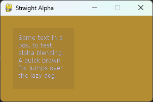
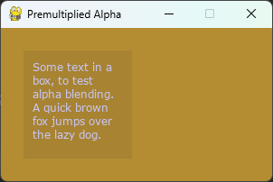

.. TUTORIAL:O que é Alfa pré-multiplicado?

.. include:: ../../common.txt

******************************************************
  Tutoriais Pygame - O que é Alfa pré-multiplicado?
******************************************************

O que é Alfa Pré-multiplicado?
==============================

.. rst-class:: docinfo

:Autor: Dan Lawrence
:Contato: danintheshed@gmail.com

Introdução à composição alfa.
-----------------------------

Composição alfa é o processo pelo qual combinamos uma ou mais imagens semitransparentes
em uma imagem final não transparente para exibição. Em pygame-ce essas imagens são chamadas de Superfícies
então usarei essa terminologia daqui para frente.

O exemplo mais simples de composição alfa é quando criamos uma superfície, preenchemos-a com uma cor
que tem um canal alfa e, em seguida, direcione essa superfície diretamente para a nossa superfície de exibição. Por exemplo:

.. code-block:: python
   :caption: Simple example of Straight Alpha composition
   :name: straight_alpha.py
   :linenos:

    import pygame
    from pygame import SRCALPHA, QUIT

    pygame.init()

    pygame.display.set_caption("Basic Composition")
    display_surf = pygame.display.set_mode((300, 170))

    # cria uma superfície com a flag SRCALPHA para adicionar um canal extra de dados
    # para cada pixel que indica quão transparente deve ser (de 0 - totalmente
    # transparente, até 255 - totalmente opaco.
    basic_surf = pygame.Surface((120, 120), flags=SRCALPHA)
    # o quarto número aqui define o alfa para 25 (quase totalmente transparente)
    basic_surf.fill((50, 50, 50, 25))

    running = True

    while running:
        for event in pygame.event.get():
            if event.type == QUIT:
                running = False

        display_surf.fill((180, 140, 50))

        display_surf.blit(basic_surf, (25, 25))

        pygame.display.flip()

Este tipo de composição alfa usa a fórmula 'Straight Alpha': ::

     resultado = (fonte.RGB * fonte.A) + (destino.RGB * (1 - fonte.A))

Nesta fórmula, nosso 'basic_surf' do código de exemplo acima seria a fonte, e nosso 'display_surf'
seria o destino.

A principal vantagem deste tipo de composição alfa é a independência de todos os canais de um
outro e a simplicidade de seu uso. Não há necessidade de configuração e a maioria dos programas de edição de imagens
exporte alfa desta forma como um canal separado. É por isso que é o método de composição padrão em
pygame-ce.

Como usar a mistura Alpha pré-multiplicada
------------------------------------------

A mistura alfa pré-multiplicada usa uma fórmula ligeiramente diferente para compor duas superfícies ::

     resultado = fonte.RGB + (destino.RGB * (1 - fonte.A))

Como você pode ver, há uma multiplicação a menos aí - isso porque, como está implícito no nome,
em uma composição alfa pré-multiplicada, todas as cores dos pixels já foram multiplicadas por seu alfa
valor do canal.

Podemos reescrever o exemplo acima para usar alfa pré-multiplicado:

.. code-block:: python
   :caption: Simple example of Premultiplied Alpha composition
   :name: premultiplied_alpha.py
   :linenos:
   :emphasize-lines: 11,23

    import pygame
    from pygame import SRCALPHA, BLEND_PREMULTIPLIED, QUIT

    pygame.init()

    pygame.display.set_caption("Basic Composition")
    display_surf = pygame.display.set_mode((300, 170))

    basic_surf = pygame.Surface((120, 120), flags=SRCALPHA)
    basic_surf.fill((50, 50, 50, 25))
    basic_surf = basic_surf.premul_alpha()

    running = True

    while running:
        for event in pygame.event.get():
            if event.type == QUIT:
                running = False

        display_surf.fill((180, 140, 50))

        display_surf.blit(basic_surf, (25, 25),
                          special_flags=BLEND_PREMULTIPLIED)

        pygame.display.flip()

Existem duas mudanças principais aqui. Primeiro definindo o modo de mesclagem no blit da mesclagem padrão
algoritmo, que usa a fórmula alfa direta, para `BLEND_PREMULTIPLIED`. Em segundo lugar, usamos o
Método `premul_alpha()` em nossa superfície alfa para retornar uma superfície onde os canais de cores foram
multiplicado pelo alfa.

Usar `premul_alpha()` é apenas uma maneira de obter uma superfície pré-multiplicada, alguns programas de edição de imagens
permitirá exportar imagens em um formato alfa pré-multiplicado ou você pode converter manualmente um
canal alfa da imagem para uma camada em tons de cinza e multiplique isso pela sua imagem antes da exportação final.

Se você executar os dois programas acima, eles deverão produzir exatamente o mesmo resultado.

Por que você usaria alfa pré-multiplicado?
------------------------------------------

Até agora, o alfa pré-multiplicado provavelmente parece apenas etapas extras para obter o mesmo resultado. Por que você
quer usá-lo em vez de alfa direto?

Existem duas razões principais – e a primeira é o desempenho. Como você viu nas duas fórmulas acima, há
é uma operação matemática a menos para fazer no momento da composição com alfa pré-multiplicado. Supondo que você esteja
não ajustar seu alfa em tempo real - e na maioria dos usos de desenvolvimento de jogos você não fará isso, esse é um
menos operação a ser feita por pixel, o que significa que, em média, seus alfa blits pré-multiplicados serão um
um pouco mais rápido do que seus ataques alfa diretos.

A segunda razão é um pouco mais complicada de demonstrar por isso preparei um programa para demonstrar
o problema. Essencialmente, a fórmula alfa direta apresenta problemas ao combinar duas superfícies que
ambos contêm pixels alfa, e o impacto disso pode variar de nada perceptível a parecer muito
bagunçado. Aqui está o programa de exemplo para alfa direto:

.. code-block:: python
   :caption: Example of Straight Alpha composition between two surfaces with per-pixel alpha
   :name: straight_alpha_tool_tip.py
   :linenos:

    import pygame

    pygame.init()

    pygame.display.set_caption("Straight Alpha")
    display_surf = pygame.display.set_mode((300, 170))

    text_font = pygame.font.Font("fonts/verdana.ttf", size=12)

    tool_tip_text = text_font.render(
        "Some text in a box, to test alpha blending. "
        "A quick brown fox jumps over the lazy dog.",
        True,
        (200, 200, 250),
        wraplength=100,
    ).convert_alpha()

    tool_tip_surf = pygame.Surface((120, 120), flags=pygame.SRCALPHA)
    tool_tip_surf.fill((50, 50, 50, 25))

    tool_tip_surf.blit(tool_tip_text, (10, 10))

    running = True

    while running:
        for event in pygame.event.get():
            if event.type == pygame.QUIT:
                running = False

        display_surf.fill((180, 140, 50))

        display_surf.blit(tool_tip_surf, (25, 25))

        pygame.display.flip()

Este exemplo aproxima o tipo de código que você pode usar para adicionar uma 'dica de ferramenta' semitransparente
caixa pop-up em um aplicativo pygame-ce. Talvez seja necessário alterar o caminho para a fonte verdana,
copie-o para um subdiretório 'fonts/' ou use uma fonte alternativa. O problema é visível em todos
fontes, mas mais óbvio em algumas fontes do que em outras, dependendo de quanto elas dependem de pixels alfa
para visibilidade. Se você executar este programa, obterá um resultado semelhante a este:

O que, a meu ver, torna o texto difícil de ler e um pouco cansativo para os olhos.

Se reescrevermos o exemplo para usar composição alfa pré-multiplicada:

.. code-block:: python
   :caption: Example of Premultiplied Alpha composition between two surfaces with per-pixel alpha
   :name: premultiplied_alpha_tool_tip.py
   :linenos:
   :emphasize-lines: 5,17,21,24,36

    import pygame

    pygame.init()

    pygame.display.set_caption("Premultiplied Alpha")
    display_surf = pygame.display.set_mode((300, 170))

    text_font = pygame.font.Font("fonts/verdana.ttf", size=12)

    tool_tip_text = text_font.render(
        "Some text in a box, to test alpha blending. "
        "A quick brown fox jumps over the lazy dog.",
        True,
        (200, 200, 250),
        wraplength=100,
    ).convert_alpha()
    tool_tip_text = tool_tip_text.premul_alpha()

    tool_tip_surf = pygame.Surface((120, 120), flags=pygame.SRCALPHA)
    tool_tip_surf.fill((50, 50, 50, 25))
    tool_tip_surf = tool_tip_surf.premul_alpha()

    tool_tip_surf.blit(tool_tip_text, (10, 10),
                       special_flags=pygame.BLEND_PREMULTIPLIED)

    running = True

    while running:
        for event in pygame.event.get():
            if event.type == pygame.QUIT:
                running = False

        display_surf.fill((180, 140, 50))

        display_surf.blit(tool_tip_surf, (25, 25),
                          special_flags=pygame.BLEND_PREMULTIPLIED)

        pygame.display.flip()

You then get a result that looks like this:

O que é muito mais fácil de ler.

Por que isso acontece? Essencialmente é porque na fórmula Straight Alpha os pixels combinados
as cores estão perdendo a influência das informações alfa dos pixels da superfície de destino.
Se você rolar de volta para a fórmula de Straight Alpha, você notará que o destino alfa
não aparece em nenhum lugar dele. No exemplo, o destino alfa deve reduzir a influência
da cor de fundo preta da caixa da dica de ferramenta nos pixels finais em grande parte, mas na linha reta
versão alfa, isso não acontece, então obtemos muito preto extra misturado nas bordas alfa de nossa luz
texto azul.

Na fórmula alfa pré-multiplicada, todos os canais de cores de ambas as superfícies já estão multiplicados por
seu canal alfa - para não perdermos nenhuma informação durante a fórmula de composição e no final
o resultado parece mais com o que esperaríamos.

---

E isso é tudo que você precisa saber sobre composição alfa e as diferenças entre composição direta
alfa e alfa pré-multiplicado. Se você quiser aprender mais, então `wikipedia has a nice long article
for further reading. <https://en.wikipedia.org/wiki/Alpha_compositing>`_
