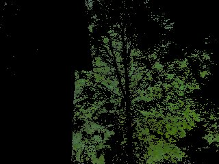
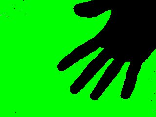

.. TUTORIAL: Introdução ao Módulo da Câmera

.. include:: ../../common.txt

********************************************************
  Tutoriais do Pygame - Introdução ao Módulo da Câmera
********************************************************

Introdução ao Módulo da Câmera
==============================

.. rst-class:: docinfo

:Author: por Nirav Patel
:Contact: nrp@eclecti.cc

O Pygame 1.9 vem com suporte para interface com câmeras, permitindo que você capture
imagens estáticas, assista transmissões ao vivo e faça alguma visão computacional simples. Este
tutorial abordará todos esses casos de uso, fornecendo exemplos de código nos quais você pode basear
seu aplicativo ou jogo. Você pode consultar a :mod:`documentação de referência <pygame.camera>` para obter a API completa.

.. note::

  A partir do Pygame 1.9, o módulo da câmera oferece suporte nativo para câmeras
  que usam v4l2 no Linux. Há suporte para outras plataformas via OpenCV,
  mas este guia se concentrará no módulo nativo. A maioria do código será
  válido para outras plataformas, mas certas coisas, como controles, não funcionarão.
  O módulo também é marcado como **EXPERIMENTAL**, o que significa que a API poderá
  mudar em versões subsequentes.

Importação e Inicialização
--------------------------

::

  import pygame
  import pygame.camera
  from pygame.locals import *

  pygame.init()
  pygame.camera.init()

Como o módulo da câmera é opcional, ele precisa ser importado e inicializado
manualmente, como mostrado acima.

Capturando uma Única Imagem
----------------------------

Agora vamos analisar o caso mais simples de abrir uma câmera e capturar um quadro
como uma superfície. No exemplo abaixo, assumimos que há uma câmera em
/dev/video0 no computador e a inicializamos com um tamanho de 640 por 480.
A superfície chamada de imagem é o que a câmera estava vendo quando get_image() foi
chamado. ::

    cam = pygame.camera.Camera("/dev/video0",(640,480))
    cam.start()
    image = cam.get_image()

Listando Câmeras Conectadas
^^^^^^^^^^^^^^^^^^^^^^^^^^^

Você pode estar se perguntando, e se não soubermos o caminho exato da câmera?
Podemos pedir ao módulo para fornecer uma lista de câmeras conectadas ao
computador e inicializar a primeira câmera da lista. ::

    camlist = pygame.camera.list_cameras()
    if camlist:
        cam = pygame.camera.Camera(camlist[0],(640,480))

Usando Controles da Câmera
^^^^^^^^^^^^^^^^^^^^^^^^^^^

A maioria das câmeras suporta controles como inverter a imagem e alterar o brilho.
set_controls() e get_controls() podem ser usados a qualquer momento após o uso de start(). ::

    cam.set_controls(hflip = True, vflip = False)
    print camera.get_controls()

Capturando uma Transmissão ao Vivo
----------------------------------

O resto deste tutorial será baseado em capturar uma transmissão ao vivo de
imagens. Para isso, usaremos a classe abaixo. Como descrito, ela
simplesmente desenha uma transmissão constante de quadros da câmera na tela, mostrando efetivamente
vídeo ao vivo. Basicamente, é o que você esperaria, fazendo loop em get_image(),
desenhando na superfície de exibição e invertendo-a. Por razões de desempenho,
forneceremos à câmera a mesma superfície para usar cada vez. ::

  class Captura:
      def __init__(self):
          self.size = (640,480)
          # cria uma superfície de exibição. coisas padrão do pygame
          self.display = pygame.display.set_mode(self.size, 0)
  
          # isto é o mesmo que vimos antes
          self.clist = pygame.camera.list_cameras()
          if not self.clist:
              raise ValueError("Desculpe, nenhuma câmera detectada.")
          self.cam = pygame.camera.Camera(self.clist[0], self.size)
          self.cam.start()
  
          # cria uma superfície para capturar. para fins de desempenho
          # a profundidade de bits é a mesma da superfície de exibição.
          self.snapshot = pygame.surface.Surface(self.size, 0, self.display)
  
      def get_and_flip(self):
          # se você não quiser vincular a taxa de quadros à câmera, pode verificar
          # se a câmera tem uma imagem pronta. observe que isso funciona
          # na maioria das câmeras, algumas nunca retornarão verdadeiro.
          if self.cam.query_image():
              self.snapshot = self.cam.get_image(self.snapshot)
  
          # desenha na superfície de exibição. simples!
          self.display.blit(self.snapshot, (0,0))
          pygame.display.flip()
  
      def main(self):
          going = True
          while going:
              events = pygame.event.get()
              for e in events:
                  if e.type == QUIT or (e.type == KEYDOWN and e.key == K_ESCAPE):
                      # fecha a câmera com segurança
                      self.cam.stop()
                      going = False
  
              self.get_and_flip()

Como get_image() é uma chamada bloqueante que pode levar bastante tempo em uma
câmera lenta, este exemplo usa query_image() para ver se a câmera está pronta.
Isso permite separar a taxa de quadros do seu jogo da taxa da câmera.
Também é possível ter a câmera capturando imagens em uma thread separada,
para ganho de desempenho aproximadamente o mesmo, se você descobrir que sua câmera não
suporta corretamente a função query_image().

Visão Computacional Básica
--------------------------

Usando os módulos de câmera, transformação e máscara, o pygame pode fazer alguma visão
computacional básica.

Espaços de Cores
^^^^^^^^^^^^^^^^

Ao inicializar uma câmera, o espaço de cores é um parâmetro opcional, com 'RGB',
'YUV' e 'HSV' como as escolhas possíveis. YUV e HSV geralmente são mais
úteis para visão computacional do que RGB e permitem fazer threshold por
cor mais facilmente, algo que veremos mais tarde no tutorial.

::

  self.cam = pygame.camera.Camera(self.clist[0], self.size, "RGB")

.. image:: ../assets/camera_rgb.jpg
   :class: trailing

::

  self.cam = pygame.camera.Camera(self.clist[0], self.size, "YUV")

.. image:: ../assets/camera_yuv.jpg
   :class: trailing

::

  self.cam = pygame.camera.Camera(self.clist[0], self.size, "HSV")

Thresholding
^^^^^^^^^^^^

Usando a função threshold() do módulo de transformação, é possível fazer
efeitos simples de tela verde ou isolar objetos de uma cor específica em uma cena.
No exemplo abaixo, fazemos threshold apenas para a árvore verde e tornamos o resto
da imagem preto. Consulte a documentação de referência para obter detalhes sobre
a :func:`função threshold <pygame.transform.threshold>`\ .

::

  self.thresholded = pygame.surface.Surface(self.size, 0, self.display)
  self.snapshot = self.cam.get_image(self.snapshot)
  pygame.transform.threshold(self.thresholded,self.snapshot,(0,255,0),(90,170,170),(0,0,0),2)

É claro que isso só é útil se você já souber a cor exata do objeto
que está procurando. Para contornar isso e tornar o threshold útil no
mundo real, precisamos adicionar uma etapa de calibração onde identificamos a cor de um
objeto e a usamos para fazer o threshold. Usaremos a função average_color()
do módulo de transformação para fazer isso. Abaixo está uma função de calibração
de exemplo que você poderia repetir até um evento, como pressionar uma tecla, e uma imagem
de como seria. A cor dentro da caixa será aquela que é
usada para o threshold. Observe que estamos usando o espaço de cores HSV nas imagens abaixo.

::

  def calibrar(self):
      # captura a imagem
      self.snapshot = self.cam.get_image(self.snapshot)
      # desenha na superfície de exibição
      self.display.blit(self.snapshot, (0,0))
      # faz um retângulo no meio da tela
      crect = pygame.draw.rect(self.display, (255,0,0), (145,105,30,30), 4)
      # obtém a cor média da área dentro do retângulo
      self.ccolor = pygame.transform.average_color(self.snapshot, crect)
      # preenche o canto superior esquerdo com essa cor
      self.display.fill(self.ccolor, (0,0,50,50))
      pygame.display.flip()

.. image:: ../assets/camera_average.jpg
   :class: trailing

::

  pygame.transform.threshold(self.thresholded,self.snapshot,self.ccolor,(30,30,30),(0,0,0),2)

.. image:: ../assets/camera_thresh.jpg
   :class: trailing

Você pode usar a mesma ideia para fazer um simples tela verde/tela azul, primeiro
obtendo uma imagem de fundo e depois fazendo threshold contra ela. O exemplo abaixo
apenas tem a câmera apontada para uma parede branca em HSV.

::

  def calibrar(self):
      # captura várias imagens de fundo
      bg = []
      for i in range(0,5):
        bg.append(self.cam.get_image(self.background))
      # média para eliminar algum ruído
      pygame.transform.average_surfaces(bg,self.background)
      # desenha na superfície de exibição
      self.display.blit(self.background, (0,0))
      pygame.display.flip()

.. image:: ../assets/camera_background.jpg
   :class: trailing

::

  pygame.transform.threshold(self.thresholded,self.snapshot,(0,255,0),(30,30,30),(0,0,0),1,self.background)

Usando o Módulo de Máscara
^^^^^^^^^^^^^^^^^^^^^^^^^^

As coisas acima são ótimas se você apenas quiser exibir imagens, mas com o
:mod:`módulo de máscara <pygame.mask>`, você também pode usar uma câmera como um
dispositivo de entrada para um jogo. Por exemplo, voltando ao exemplo de
fazer threshold de um objeto específico, podemos encontrar a posição desse objeto e
usá-lo para controlar um objeto na tela.

::

  def get_and_flip(self):
      self.snapshot = self.cam.get_image(self.snapshot)
      # faz threshold da cor que obtivemos antes
      mask = pygame.mask.from_threshold(self.snapshot, self.ccolor, (30, 30, 30))
      self.display.blit(self.snapshot,(0,0))
      # mantenha apenas o maior bloco dessa cor
      connected = mask.connected_component()
      # certifique-se de que o bloco seja grande o suficiente para não ser apenas ruído
      if mask.count() > 100:
          # encontre o centro do bloco
          coord = mask.centroid()
          # desenha um círculo com variável de tamanho no tamanho do bloco
          pygame.draw.circle(self.display, (0,255,0), coord, max(min(50,mask.count()/400),5))
      pygame.display.flip()

.. image:: ../assets/camera_mask.jpg
   :class: trailing

Este é apenas o exemplo mais básico. Você pode rastrear várias cores diferentes
blobs, encontrar as bordas dos objetos, ter detecção de colisão entre objetos da vida
real e objetos do jogo, obter o ângulo de um objeto para permitir um controle ainda mais preciso,
e muito mais. Divirta-se!
