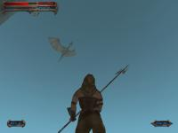
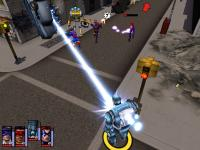

.. TUTORIAL:Introdução ao Pygame Python

.. include:: ../../common.txt

************************
  Introdução ao Pygame
************************

Introdução ao Python Pygame
===========================

.. rst-class:: docinfo

:Author: Pete Shinners
:Contact: pete@shinners.org

Este artigo é uma introdução à `biblioteca pygame <https://pyga.me>`_
para `programadores Python <https://www.python.org/>`_.
A versão original apareceu no `PyZine volume 1 issue 3
<https://web.archive.org/web/20030810011958/http://store.pyzine.com:80/article.phtml?a=2>`_.
Esta versão contém revisões mínimas, para
criar um artigo geralmente melhor. Pygame é uma extensão Python
que envolve a biblioteca `SDL <http://www.libsdl.org>`_
e seus ajudantes.

HISTÓRIA
--------

O Pygame começou no verão de 2000. Sendo um programador C de muitos
anos, descobri o Python e o SDL quase ao mesmo tempo. Você já está
familiarizado com o Python, que estava na versão 1.5.2. Você pode precisar
de uma introdução ao SDL, que é a Simple DirectMedia Layer.
Criada por Sam Lantinga, a SDL é uma biblioteca C multiplataforma para
controle de multimídia, comparável ao DirectX. Ela foi usada em
centenas de jogos comerciais e de código aberto. Fiquei impressionado
com o quão limpos e diretos eram ambos os projetos, e não demorou muito
para perceber que misturar Python e SDL era uma proposta interessante.

Descobri um pequeno projeto já em andamento com exatamente a mesma
ideia, o PySDL. Criado por Mark Baker, o PySDL era uma implementação direta
da SDL como uma extensão Python. A interface era mais limpa
do que uma abordagem genérica de SWIG, mas eu senti que forçava um estilo "C" de código.
A morte súbita do PySDL me incentivou a assumir um novo projeto próprio.

Eu queria criar um projeto que realmente aproveitasse
o Python. Meu objetivo era tornar fácil fazer coisas simples e
direto fazer coisas difíceis. O Pygame começou em
outubro de 2000. Seis meses depois, a versão 1.0 do pygame foi lançada.

GOSTINHO
--------

Acho que a melhor maneira de entender uma nova biblioteca é pular direto
em um exemplo. Nos primeiros dias do pygame, criei uma animação de bola quicando
com 7 linhas de código. Vamos dar uma olhada em uma versão mais amigável
da mesma coisa. Isso deve ser simples o suficiente para acompanhar,
e uma análise completa segue abaixo.

.. image:: ../assets/intro_ball.gif
   :class: inlined-right

.. code-block:: python
   :linenos:

   import sys, pygame
   pygame.init()

   size = width, height = 320, 240
   speed = [2, 2]
   black = 0, 0, 0

   screen = pygame.display.set_mode(size)

   ball = pygame.image.load("intro_ball.gif")
   ballrect = ball.get_rect()

   while True:
       for event in pygame.event.get():
           if event.type == pygame.QUIT: sys.exit()

       ballrect = ballrect.move(speed)
       if ballrect.left < 0 or ballrect.right > width:
           speed[0] = -speed[0]
       if ballrect.top < 0 or ballrect.bottom > height:
           speed[1] = -speed[1]

       screen.fill(black)
       screen.blit(ball, ballrect)
       pygame.display.flip()

Isso é o mais simples possível para uma animação de quicar.
Primeiro, vemos que importar e inicializar o pygame não é nada notável.
O ``import pygame`` importa o pacote com todos os
módulos disponíveis do pygame.
A chamada para ``pygame.init()`` inicializa cada um desses módulos.

Na :clr:`linha 8`, criamos uma
janela gráfica com a chamada ``pygame.display.set_mode()``.
O pygame e o SDL facilitam isso, definindo automaticamente os melhores modos gráficos
para o hardware gráfico. Você pode substituir o modo e o SDL
compensará qualquer coisa que o hardware não possa fazer. O pygame representa
imagens como objetos *Surface*.
A função ``display.set_mode()`` cria um novo objeto *Surface*
que representa os gráficos reais exibidos. Qualquer desenho que você
faça neste Surface se tornará visível no monitor.

Na :clr:`linha 10`, carregamos
nossa imagem de bola. O pygame suporta uma variedade de formatos de imagem através
da biblioteca SDL_image, incluindo BMP, JPG, PNG, TGA e GIF.
A função ``pygame.image.load()``
retorna um Surface com os dados da bola. O Surface manterá qualquer
colorkey ou transparência alfa do arquivo. Após carregar a imagem da bola,
criamos uma variável chamada ballrect. O pygame vem com um
tipo de objeto utilitário conveniente chamado :class:`Rect <pygame.Rect>`,
que representa uma área retangular. Mais tarde, na parte de
animação do código, veremos o que os objetos *Rect* podem fazer.

Neste ponto, na :clr:`linha 13`,
nosso programa está inicializado e pronto para ser executado. Dentro de um loop infinito,
verificamos a entrada do usuário, movemos a bola e depois desenhamos a bola.
Se você está familiarizado com a programação de GUI, já teve experiência com eventos e
loops de eventos. No pygame, isso não é diferente,
verificamos se ocorreu um evento *QUIT*. Se sim, simplesmente
saímos do programa; o pygame garantirá que tudo seja encerrado corretamente.

É hora de atualizar nossa posição para a bola.
:clr:`As linhas 17` movem a variável ballrect pela velocidade atual.
:clr:`As linhas 18 a 21` invertem a velocidade se a bola se moveu para fora da tela.
Não é exatamente física newtoniana, mas é tudo o que precisamos.

Na :clr:`linha 23`, apagamos
a tela preenchendo-a com uma cor RGB preta. Se você nunca
trabalhou com animações, isso pode parecer estranho. Você pode estar se perguntando "Por que precisamos apagar alguma coisa, por que não movemos simplesmente a bola na tela?" Isso não é exatamente como funciona a animação de computador. A animação
nada mais é do que uma série de imagens únicas, que quando exibidas em
sequência fazem um ótimo trabalho em enganar o olho humano para ver
movimento. A tela é apenas uma única imagem que o usuário vê. Se não tomássemos o cuidado de apagar a bola da tela, veríamos realmente um "rastro" da bola enquanto continuamos a desenhar a bola em suas novas posições.

Na :clr:`linha 24`, desenhamos a imagem da bola na tela.
O desenho de imagens é tratado pelo método
:meth:`Surface.blit() <pygame.Surface.blit>`.
Um blit basicamente significa copiar cores de pixels de uma imagem para outra.
Passamos o método blit um :class:`Surface <pygame.Surface>`
de origem para copiar, e uma posição para colocar a origem no destino.

A última coisa que precisamos fazer é realmente atualizar a exibição visível.
O pygame gerencia a exibição com um buffer duplo. Quando terminamos
de desenhar, chamamos o método :func:`pygame.display.flip()`.
Isso faz com que tudo o que desenhamos no Surface da tela
se torne visível. Esse buffer garante que só vemos quadros completamente desenhados na tela. Sem isso, o usuário veria as partes pela metade da tela enquanto estão sendo criadas.

Isso conclui esta breve introdução ao pygame. O pygame também possui
módulos para fazer coisas como lidar com entrada para teclado, mouse e
joystick. Pode misturar áudio e decodificar música em streaming.
Com os *Surfaces*, você pode desenhar formas simples,
rotacionar e dimensionar a imagem, e até mesmo manipular os pixels de
uma imagem em tempo real como arrays numpy.
O pygame também tem a capacidade de atuar como uma
camada de exibição multiplataforma para o PyOpenGL. A maioria dos módulos do pygame
é escrita em C, poucos são realmente feitos em Python.

O site do pygame possui documentação de referência completa para cada função do pygame
e tutoriais para todos os tipos de usuários. O código-fonte do pygame vem
com muitos exemplos de coisas como socos de macaco e tiros de OVNI.

PYTHON E JOGOS
--------------

"O Python é adequado para jogos?" A resposta é: "Depende do
jogo."

O Python é realmente capaz de executar jogos. Provavelmente até
surpreenderá você o quanto é possível em menos de 30 milissegundos. Ainda assim,
não é difícil atingir o limite quando seu jogo começa a ficar mais
complexo. Qualquer jogo em tempo real estará fazendo amplo uso do
computador.

Nos últimos anos, houve uma tendência interessante no desenvolvimento de jogos,
a mudança para linguagens de nível mais alto. Normalmente, um jogo é dividido em
duas partes principais. O motor do jogo, que deve ser o mais rápido possível,
e a lógica do jogo, que faz o motor realmente fazer algo.
Não faz muito tempo, quando o motor de um jogo era escrito em assembly, com
partes escritas em C. Hoje em dia, C mudou-se para o motor do jogo, enquanto
muitas vezes o próprio jogo é escrito em linguagens de script de nível mais alto.
Jogos como Quake3 e Unreal executam esses scripts como bytecode portátil.

No início de 2001, a desenvolvedora Rebel Act Studios concluiu seu jogo,
Severance: Blade of Darkness. Usando seu próprio motor 3D personalizado, o
resto do jogo é escrito em Python. O jogo é um sangrento lutador de ação
3ª pessoa. Você controla guerreiros medievais em ataques combinados intricados enquanto explora masmorras e
castelos. Você pode baixar complementos de terceiros para este jogo e perceber
que eles não são nada mais do que arquivos-fonte Python.

Mais recentemente, o Python tem sido usado em uma variedade de jogos como Freedom
Force, e na série Backyard Sports da Humungous.

O Pygame e o SDL servem como um excelente motor C para jogos 2D.
Os jogos ainda encontrarão a maior parte de seu tempo de execução
dentro do SDL manipulando os gráficos.
A SDL pode tirar proveito da aceleração de hardware gráfico.
Habilitar isso pode mudar um jogo de rodar em torno de 40 quadros por
segundo para mais de 200 quadros por segundo. Quando você vê seu jogo Python
rodando a 200 quadros por segundo, percebe que Python e jogos podem
trabalhar juntos.

É impressionante o quão bem tanto o Python quanto o SDL funcionam em várias
plataformas. Por exemplo, em maio de 2001, lancei meu próprio projeto completo do pygame,
SolarWolf, um jogo de ação estilo arcade. Uma coisa que me surpreendeu é que um ano depois não houve necessidade de nenhum
correções, correções de bugs ou atualizações. O jogo foi desenvolvido inteiramente em
Windows, mas roda no Linux, no Mac OSX e em muitos Unixes sem nenhum trabalho extra da minha parte.

Ainda assim, existem limitações muito claras. A melhor maneira de gerenciar
gráficos acelerados por hardware nem sempre é a maneira de obter os resultados mais rápidos
da renderização de software. O suporte de hardware não está disponível em
todas as plataformas. Quando um jogo fica mais complexo, muitas vezes deve se comprometer
com um ou outro. A SDL tem algumas outras limitações de design, coisas como
gráficos de rolagem em tela cheia podem rapidamente reduzir a velocidade do seu jogo para
velocidades impraticáveis. Embora a SDL não seja adequada para todos os tipos de jogos,
lembre-se de que empresas como a Loki usaram a SDL para executar uma ampla variedade de
títulos de qualidade de varejo.

O Pygame é bastante baixo nível quando se trata de escrever jogos. Você
rapidamente se verá precisando envolver funções comuns em seu próprio
ambiente de jogo. A grande coisa sobre isso é que não há nada dentro
do pygame para atrapalhar. Seu programa está no controle total
de tudo. O efeito colateral disso é que você se verá pegando
muito código emprestado para montar um framework mais avançado. Você
precisará de uma compreensão melhor do que está fazendo.

ENCERRAMENTO
------------

Desenvolver jogos é muito gratificante, há algo empolgante em
poder ver e interagir com o código que você escreveu. Atualmente, o pygame tem quase 30
outros projetos o usando. Vários deles estão
prontos para jogar agora. Você pode se surpreender ao visitar o site do pygame,
e ver o que outros usuários conseguiram fazer com o Python.

Uma coisa que chamou minha atenção é a quantidade de pessoas que estão vindo
para o Python pela primeira vez para tentar o desenvolvimento de jogos. Eu posso ver por que
os jogos são um atrativo para novos programadores, mas pode ser difícil, já que
criar jogos requer uma compreensão mais firme da linguagem. Eu tenho
tentado apoiar esse grupo de usuários escrevendo muitos exemplos e
tutoriais do pygame para pessoas novas nesses conceitos.

No final, meu conselho é manter simples. Eu não posso enfatizar isso
o suficiente. Se você está planejando criar seu primeiro jogo, há
muito o que aprender. Mesmo um jogo mais simples desafiará seus projetos, e
jogos complexos não significam necessariamente jogos divertidos. Quando você entender
Python, você pode usar o pygame para criar um jogo simples em apenas uma ou duas
semanas. A partir daí, você precisará de uma quantidade surpreendente de tempo para adicionar
o polimento para transformá-lo em um jogo totalmente apresentável.

Visão Geral dos Módulos do Pygame
^^^^^^^^^^^^^^^^^^^^^^^^^^^^^^^^^

.. csv-table::
   :class: more-to-explore
   :widths: 20, 50

   :mod:`cursors <pygame.cursors>`, "carrega imagens de cursor, inclui cursores padrão"
   :mod:`display <pygame.display>`, "controla a janela ou tela de exibição"
   :mod:`draw <pygame.draw>`, "desenha formas simples em uma Surface"
   :mod:`event <pygame.event>`, "gerencia eventos e a fila de eventos"
   :mod:`font <pygame.font>`, "cria e renderiza fontes TrueType"
   :mod:`image <pygame.image>`, "salva e carrega imagens"
   :mod:`joystick <pygame.joystick>`, "gerencia dispositivos de joystick"
   :mod:`key <pygame.key>`, "gerencia o teclado"
   :mod:`mouse <pygame.mouse>`, "gerencia o mouse"
   :mod:`sndarray <pygame.sndarray>`, "manipula sons com numpy"
   :mod:`surfarray <pygame.surfarray>`, "manipula imagens com numpy"
   :mod:`time <pygame.time>`, "controla o tempo"
   :mod:`transform <pygame.transform>`, "dimensiona, rotaciona e inverte imagens"
